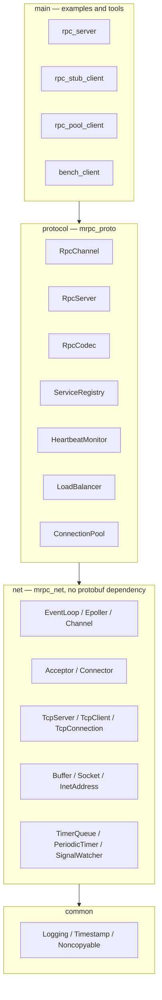
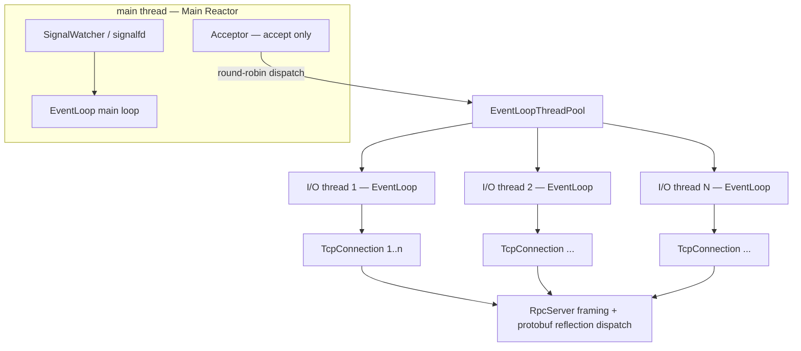
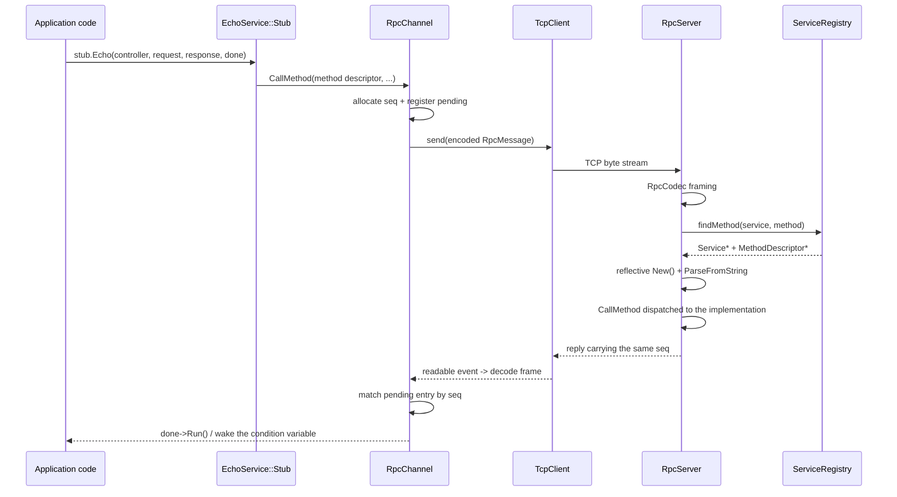
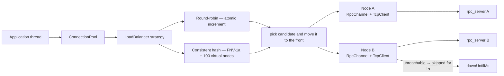

# mini-rpc

[English](README.en.md) | [中文](README.md)

[](https://github.com/TiptopCash/mini-rpc/actions/workflows/ci.yml)
[](LICENSE)

> An epoll-based C++17 RPC framework: master-slave Reactor + custom binary protocol + protobuf reflection dispatch + client-side connection pool

An RPC framework built from scratch, with no third-party networking library
(no muduo, no gRPC). The goal is to make the whole path — from generated stub
call to the peer executing it — actually work, and to verify every critical path
(partial writes, heartbeat timeouts, request-level timeout fallback, failover)
with **measured data** rather than "it compiled, so it must be fine."

---

## 1. Overview

| Item | Value |
|---|---|
| Language standard | C++17 |
| Build | CMake 3.16+, Release by default |
| Dependencies | protobuf 3.21.12 (serialization + reflection dispatch), pthread; **no networking library** |
| Dev environment | Windows 11 + WSL2 (Ubuntu), g++ 15.2 / cmake 3.28.3 |
| Code size | **65 source files, ~5,850 lines of C++** (excluding protobuf-generated code and tests) |
| Network model | epoll + **master-slave Reactor**, one loop per thread, multiple I/O threads |
| Protocol | 8-byte fixed header (magic / version / type / bodyLen) + protobuf body |
| Quality tooling | ASan + UBSan + LeakSanitizer (with a positive control), 8 end-to-end verification scripts |

**Key design tradeoffs**

- **The fixed header carries framing fields only**; business fields such as `seq` live entirely in the protobuf body — a single source of truth avoids the two definitions drifting apart.
- **The network layer does not depend on protobuf** (`mrpc_net` is a standalone static library), so logic that needs to encode RPC frames — heartbeats, timeouts — lives in `mrpc_proto`.
- **Anything owning a `Channel` must be destroyed on its own loop thread**, which is why `EventLoop` provides `runInLoopAndWait`.
- **One connection multiplexes concurrent in-flight requests by `seq`**, which is why the pool keeps exactly one connection per node.

---

## 2. Repository layout

```
.
├── CMakeLists.txt
├── proto/rpc.proto              # Protocol messages + EchoService declaration
├── scripts/                     # 8 end-to-end verification scripts
└── src/
    ├── common/                  # Logging, timestamps, Noncopyable
    ├── net/                     # Network layer (no protobuf dependency, reusable standalone)
    │   ├── EventLoop / Epoller / Channel
    │   ├── Acceptor / Connector / TcpConnection
    │   ├── TcpServer / TcpClient / EventLoopThread(Pool)
    │   ├── Buffer / Socket / InetAddress
    │   └── PeriodicTimer / TimerQueue / SignalWatcher
    ├── protocol/                # Protocol layer (fixed-header framing + protobuf)
    │   ├── RpcHeader / RpcCodec / RpcError / RpcController
    │   ├── HeartbeatMonitor / ServiceRegistry
    │   ├── RpcServer / RpcChannel
    │   └── LoadBalancer / ConnectionPool
    ├── main/                    # Examples and tools (including a hand-written load generator)
    └── test/                    # Unit tests (codec / timer_queue / tcp_client)
```

---

## 3. Implemented modules

### 3.1 Architecture

**Layering**: `main` → `protocol` → `net` → `common`, one direction only.
`net` has no protobuf dependency (so it can be reused standalone), which is why logic that
needs to encode RPC frames — heartbeats, request timeouts — lives in `protocol`.



**Master-slave Reactor**: the main thread only `accept`s; new connections are round-robined to
I/O threads. Each I/O thread owns one `EventLoop` (one loop per thread) and no connection state
is shared across threads.



**The full path of one RPC call** (from generated stub to peer execution and back):



**Connection pool and load balancing**: the pool owns an `EventLoopThread`; one connection per
node (the protocol multiplexes by seq, so a single connection already supports many in-flight
requests).



### 3.2 Network layer `mrpc_net`

| Module | File | Notes |
|---|---|---|
| Event loop | `EventLoop` | One loop per thread; `eventfd` to wake `epoll_wait`; cross-thread task posting (`runInLoop` / `queueInLoop`); `runInLoopAndWait` gives a "switch to the loop thread and block until done" primitive used for teardown |
| Multiplexing | `Epoller` | epoll wrapper; stores `Channel*` directly in `data.ptr` for O(1) lookup; grows the event array automatically when it fills up |
| Event channel | `Channel` | Event mask + callback dispatch; `tie()` holds a `weak_ptr` so the owner stays alive during its own callback |
| Listening | `Acceptor` | Non-blocking `accept4`, `SO_REUSEPORT` |
| Non-blocking connect | `Connector` | `EINPROGRESS` → `EPOLLOUT` → `getsockopt(SO_ERROR)` for the real result; exponential backoff retry (200 ms initial, 5 s cap); fd ownership transferred via `Socket::release()` |
| Connection | `TcpConnection` | `shared_ptr` lifetime; output buffer + `EPOLLOUT` for partial writes; half-close handling |
| Server | `TcpServer` | Connection table; **deferred destruction** (`queueInLoop(connectDestroyed)`, so it never destroys itself on its own member-function stack) |
| Client | `TcpClient` | Composes Connector + TcpConnection; auto-reconnect on disconnect |
| I/O thread pool | `EventLoopThreadPool` | New connections round-robined across I/O threads |
| Buffer | `Buffer` | `readv` scatter-read with a 64 KB stack scratch buffer; `readerIndex`/`writerIndex` make `retrieve` O(1) |
| Socket | `Socket` | fd RAII; `TCP_NODELAY` / `SO_REUSEADDR` / `SO_REUSEPORT` |
| Periodic timer | `PeriodicTimer` | timerfd-backed periodic timer for long-lived tasks such as heartbeat sweeps |
| Timer collection | `TimerQueue` | **One timerfd per loop + a min-heap** to carry many short-lived timers; lazy deletion with an `active_` map for O(1) cancel; repeating timers are re-based on the original expiration, so **no drift** |
| Signals | `SignalWatcher` | signalfd turns SIGINT/SIGTERM into ordinary epoll events; `sigprocmask` must run before the I/O threads are created |

### 3.3 Protocol layer `mrpc_proto`

| Module | File | Notes |
|---|---|---|
| Header | `RpcHeader` | 8-byte fixed header, big-endian, 64 MB body cap against malicious frames |
| Codec | `RpcCodec` | Fixed-header framing; returns `kOk` / `kIncomplete` (partial frame stays buffered) / `kError` (byte stream desynchronized, close the connection) |
| Messages | `proto/rpc.proto` | `RpcMessage` (seq / service / method / payload / error) + `EchoService` (`option cc_generic_services = true`) |
| Call context | `RpcController` | Implements `google::protobuf::RpcController`; **one per request**, so no locking needed |
| Heartbeat | `HeartbeatMonitor` | Periodic sweep: send ping when idle, force-close on timeout; **judges by receive time only**, otherwise its own pings would keep resetting the timer |
| Service registry | `ServiceRegistry` | Expands `"Service.Method"` → `{Service*, MethodDescriptor*}` at registration time, O(1) at runtime; **non-owning**; distinguishes unknown service from unknown method |
| RPC server | `RpcServer` | Composes TcpServer + heartbeat + framing + **protobuf reflection dispatch**; `MethodDone` supports both sync and async implementations; **request-level timeout fallback** (if the implementation forgets `done->Run()`, reply with a timeout and reclaim the objects) |
| RPC client | `RpcChannel` | Implements `google::protobuf::RpcChannel`; **seq multiplexing**; synchronous calls block on a condition variable, asynchronous calls run `done->Run()` on the I/O thread; per-call timeout via `TimerQueue`; a late response whose seq is no longer pending is simply dropped |
| Load balancing | `LoadBalancer` | Round-robin (atomic increment) / consistent hashing (FNV-1a + 100 virtual nodes, ring rebuilt only when the node list changes) |
| Connection pool | `ConnectionPool` | Owns its own `EventLoopThread`; one connection per node; sequential failover after the strategy picks a node; unreachable nodes enter a **cooldown** |

### 3.4 Examples and tools

| Program | Purpose |
|---|---|
| `echo_server` / `echo_client` | Basic echo server / synchronous blocking client |
| `bench_client` | **Hand-written multithreaded load generator**, reports QPS and P50/P90/P99/P999 |
| `slow_reader` | Slow-reading client that forces the `EPOLLOUT` partial-write path |
| `proto_echo_server` / `proto_echo_client` | Protocol-layer end-to-end (coalesced / split packets) verification |
| `idle_client` | Idle-connection test (switchable between replying ack and ignoring pings) |
| `rpc_server` | Reflection-dispatch example server; the `nodeTag` argument identifies the node in pool demos |
| `rpc_client` | Raw-socket RPC client: normal calls + 5 error classes + concurrent connections |
| `rpc_stub_client` | Full client path: sync / async / business failure / client timeout / connection still usable after a timeout |
| `rpc_pool_client` | Connection pool + load balancing: round-robin spread / consistent-hash stickiness / single-node failover |

---

## 4. Progress

| Phase | Content | Status |
|---|---|---|
| Weeks 1–2 | Network layer: epoll master-slave Reactor, I/O thread pool, application-level buffer | ✅ Done |
| Weeks 3–4 | Custom RPC protocol + protobuf serialization + heartbeat keepalive | ✅ Done |
| Weeks 5–6 | Server: protobuf reflection dispatch + service registry | ✅ Done |
| Weeks 7–8 | Client: `RpcChannel` + connection pool + load balancing | ✅ Done |
| Weeks 9–10 | Service discovery (ZooKeeper) + load testing + coroutine/memory-pool optimization | ⬜ Not started |

---

## 5. Test and verification record

Everything below is measured locally over WSL2 loopback; the scripts under
`scripts/` reproduce each result.

### 5.1 Memory safety (ASan + UBSan + LeakSanitizer)

- Build: `-fsanitize=address,undefined -fno-omit-frame-pointer -g` (Debug)
- Coverage: 5,000 messages of normal traffic + 30 abrupt disconnects (`kill -9`) + 200 × 64 KB messages
  + the full client path (sync/async/timeout) + pool round-robin/consistent-hash/failover
- **Result: ASan / UBSan / LeakSanitizer reports all empty**

> **Why an empty report is trustworthy**: early on the server was terminated by `kill`,
> so destructors never ran, LeakSanitizer had nothing to judge, and the test had to set
> `detect_leaks=0` — the claim "no leaks" was not actually verified. After adding graceful
> shutdown via signalfd we switched to `detect_leaks=1` and added a **positive control**
> (`new int[100]` deliberately leaked) to confirm the detector really works.
> Only with a control does an empty report mean anything.

### 5.2 Boundaries and concurrency

| Scenario | Result |
|---|---|
| 200 concurrent connections × 200 messages | 0 failures, 0.16–0.18 s |
| 64 KB × 2,000 messages | ≈ 21k–23k QPS (three runs: 20,875 / 21,661 / 22,973), server stayed up |
| 30 abrupt disconnects (`kill -9`) | all connections reclaimed correctly, no crash |

### 5.3 EPOLLOUT partial-write path

**Why verify this specifically**: the socket is non-blocking, so if partial-write handling
were missing, data beyond the kernel buffer would be silently dropped. In normal operation
a small message is written in one shot and this path is never exercised.

**Method**: send 64 MB, then read nothing for 5 seconds, forcing the server into
"`::write` returns `EAGAIN` → data goes into `outputBuffer_` → `enableWriting` → `EPOLLOUT` resumes".

**Why the setup is sound**:

```
tcp_rmem max = 32 MB   (client receive buffer cap)
tcp_wmem max =  4 MB   (server send buffer cap)
kernel can absorb at most 36 MB  ->  sending 64 MB > 36 MB
the surplus must remain in the server's application-level outputBuffer_
```

**Direct evidence (server process RSS sampling)**:

```
baseline RSS     =  3,976 kB
during the stall = 67,160 kB
delta            = 63,184 kB   <- the data parked in outputBuffer_
```

RSS sampling itself jitters by a few MB (an earlier run gave 4,000 / 67,180 / 63,180 kB),
but the delta is stable in the **63 MB** range, which matches the "kernel absorbs at most 36 MB"
calculation.

**Result**: all 64 MB was received back and verified byte-for-byte, and the server logged no errors.

### 5.4 Protocol layer (framing + protobuf)

**Unit test `codec_test`: 33 checks, 0 failures**

| Case | Coverage |
|---|---|
| Round trip | encode → parse, every field matches |
| **Split packet (byte by byte)** | feeding 1 byte at a time must return `kIncomplete` until the last byte yields `kOk` |
| **Coalesced packets (3 frames)** | parse 3 consecutive frames from one buffer, in order and with correct contents |
| Malformed frames ×5 | bad magic, incompatible version, oversized body, truncated header, invalid protobuf body |
| Empty body | a heartbeat frame parses successfully |
| 1 MB body | contents intact after the buffer grows across reads |

**End to end**: the first 500 messages are concatenated into a single byte stream written at once
(forcing coalescing); the last 500 are each split into two segments written 0.5 ms apart
(forcing splitting).

```
sent:     1000 (500 coalesced + 500 split)
received: 1000
sequence continuity: correct (0 anomalies)
content consistency: correct (0 anomalies)
```

### 5.5 Heartbeat and idle detection (`heartbeat_test`)

Config: sweep every 1 s, send a ping after 2 s idle, force-close after 5 s idle.

**Case 1 — client replies ack (an idle but healthy connection must survive)**: idle for 8 seconds
and **not** disconnected; every ack refreshed the receive time (which is why the server's ping
interval is 3 s rather than 2 s).

**Case 2 — client ignores pings (a dead connection must be reclaimed)**:

```
17:54:22  ping #2 (idle 2s)
17:54:23  ping #2 (idle 3s)
17:54:24  ping #2 (idle 4s)
17:54:25  WARN  idle 5s >= timeout 5s, force close
```

**Closed exactly at 5 s.**

### 5.6 Server-side reflection dispatch (`rpc_test`)

Single connection 2,000 messages + 5 error classes + 4 concurrent connections × 2,000 messages:

```
normal calls: 2000/2000 succeeded, 0 sequence anomalies, 0 content anomalies
error cases:
  unknown service  -> error_code=1  [OK]
  unknown method   -> error_code=2  [OK]
  bad payload      -> error_code=3  [OK]
  business failure -> error_code=4  [OK]
  missed done->Run -> error_code=6  [OK]   (request-level timeout fallback)
connection still usable after an error: [OK]
4 concurrent connections x 2000 messages: 0 failures
```

**Reflection dispatch in three steps**:

```
1. ServiceRegistry::findMethod("mrpc.EchoService", "Echo")  -> Service* + MethodDescriptor*
2. service->GetRequestPrototype(md).New()                   // reflectively construct the concrete type
   request->ParseFromString(msg.payload())
3. service->CallMethod(md, controller, request, response, done)
```

The framework only ever holds `Message*` base pointers and never knows the concrete type —
**adding an RPC method means editing the `.proto` only; `RpcServer` / `ServiceRegistry` /
`RpcCodec` need no changes at all.**

### 5.7 Graceful shutdown and leak detection (`verify.sh` / `rpc_test.sh`)

**signalfd** wires signals into epoll — the same idea as the existing `eventfd` (wakeup) and
`timerfd` (timers). A signal is no longer an asynchronous handler but an ordinary readable fd:

```
SIGINT/SIGTERM --(blocked via sigprocmask)--> pending on the process
              --(signalfd)--> readable event --> the main loop's Channel callback
              --> loop.quit() --> loop() returns normally --> objects destroyed in order
```

**The pitfall**: `sigprocmask` must run **before the I/O threads are created**. A new thread
inherits the signal mask as of its creation, so if you start the I/O threads first, they still
take the default action for SIGTERM and the process is killed anyway.

```
SigBlk: 0000000000004002      # bit1=SIGINT(2), bit14=SIGTERM(15)
tasks = 5                     # main thread + 4 I/O threads all inherited it
```

Result: after SIGTERM, `loop()` returns normally, objects are destroyed in order, and the
process exits with `0`.

### 5.8 General-purpose timers and request-level timeout fallback

`PeriodicTimer` can only express "a long-lived task on a fixed period" and cannot carry
per-request timeout timers (that would mean one timerfd per request and exhaust fds).
`TimerQueue` manages an arbitrary number of timers with **one timerfd per loop + a min-heap**.

**Unit test `timer_queue_test`: 6 cases, all passing**

```
[1] one-shot timers fire in expiration order (inserted 30/10/20 -> fire 10/20/30)
[2] cancel a timer that has not yet expired
[3] cancel an unknown id and cancel twice (no crash, unrelated timers unaffected)
[4] repeating timer that cancels itself inside its own callback
[5] repeating timers accumulate no drift  -> measured total 215 ms (expected ~215 ms)
[6] cross-thread addTimer / cancelTimer (firing accurate; queueing delay not counted)
```

**Case 5 is the whole point of this implementation**: the callback itself takes 15 ms and the
interval is 20 ms. The naive "wait one more interval after the callback returns" approach needs
`10 × (20+15) = 350 ms` for 10 rounds, and the error grows linearly with the round count;
re-basing on the **original expiration** stays in the 200 ms range, and the measured 215 ms matches.

**Request-level timeout fallback**: when an implementation forgets `done->Run()`, the framework
replies with `kRpcTimeout` after `requestTimeoutMs_` and reclaims request / response / controller
/ `MethodDone`. The key is that **the arbitration flag lives in a separate shared object**:

```cpp
struct RequestGate { std::atomic<bool> finished{false}; ... };
if (gate->finished.exchange(true)) return;   // CAS decides the winner; the loser just returns
```

The flag cannot live inside `MethodDone` — the CAS winner `delete`s the `MethodDone`, so the
loser reading its member afterwards is a use-after-free.

**Measured**:

```
server log: timed out in mrpc.EchoService.NoReply
client log: no pending call for seq ...      <- the late response after the timeout is dropped
LeakSanitizer report empty                   <- the previously always-leaked objects are reclaimed
```

The "late response dropped" path is **deliberately constructed**: the client timeout is set to
150 ms and the server fallback to 400 ms, so the fallback response necessarily arrives after the
client has removed the pending entry.

### 5.9 Full client path (`stub_client_test`)

Path: `EchoService::Stub` (the dynamic proxy generated by protoc) → `RpcChannel` →
`TcpClient` → `Connector` → non-blocking connect.

```
sync call: succeeded 200/200 [OK]
sync business failure: [OK] (text must not be empty)
async call: succeeded 200/200 [OK]
async business failure: [OK] (text must not be empty)
timeout call: [OK] (rpc call timed out after 150 ms)
connection still usable after a timeout: [OK]
```

`tcp_client_test` additionally covers: non-blocking connect + send/receive / backoff-retry until
connected when the peer is not yet ready / automatic reconnect after the peer disconnects
(all 3 cases pass).

### 5.10 Connection pool and load balancing (`pool_client_test`)

Two backend nodes (`nodeTag` A / B), 100 client calls:

```
---- round-robin ----
round-robin: succeeded 100/100  [A]=50  [B]=50
---- consistent hashing (fixed key) ----
consistent hashing: succeeded 100/100  [B]=100
consistent hashing (another key): succeeded 100/100  [B]=100
---- failover (after killing node B) ----
failover: succeeded 100/100  [A]=100
```

**Controlled experiment on the failed-node cooldown**: the first version had no cooldown, so a
single dead node made **every** `getChannel()` wait out the full connect timeout (3 s). With one
node available and 10 calls:

| Cooldown | Elapsed | Result |
|---|---:|---|
| None (cooldown set to 0) | **15.0 s** | 10/10 succeeded |
| 1 s | **3.0 s** | 10/10 succeeded |

With no cooldown, round-robin makes half the calls (5) each pay a 3-second connect timeout,
i.e. `5 × 3s = 15s`. The real difference is that the timeout is paid **at most once per cooldown
window** instead of once per call, so the denser the calls, the wider the gap.

### 5.11 Verification scripts

| Script | Contents |
|---|---|
| `scripts/verify.sh` | ASan/UBSan build and run + boundary tests |
| `scripts/bench.sh` | Load tests across several configurations |
| `scripts/slow_reader_test.sh` | Forced `EPOLLOUT` partial-write test (with RSS sampling) |
| `scripts/proto_test.sh` | Protocol unit tests + end-to-end (coalesced/split packets) |
| `scripts/heartbeat_test.sh` | Heartbeat keepalive + idle timeout disconnect |
| `scripts/rpc_test.sh` | Reflection dispatch + error codes + concurrency + graceful shutdown; includes LeakSanitizer with a positive control |
| `scripts/stub_client_test.sh` | Client path + timeout fallback + dropped late responses |
| `scripts/pool_client_test.sh` | Round-robin spread + consistent-hash stickiness + failover |

---

## 6. Performance

### Test conditions

- Server: 4 I/O threads (`echo_server 9100 4`)
- Client: `bench_client`, multithreaded synchronous request-response, one connection per thread
- Environment: WSL2 loopback, **client and server on the same machine**
- Messages: echo round trip

### Results

| Client threads | Message size | QPS | P50 | P90 | P99 | P999 | Failures |
|---:|---:|---:|---:|---:|---:|---:|---:|
| 4 | 64 B | 101,398 | 37.2 µs | 43.4 µs | 100.0 µs | 191.2 µs | 0 |
| **8** | **64 B** | **195,350** | **30.2 µs** | 69.7 µs | **115.0 µs** | 171.8 µs | 0 |
| 16 | 64 B | **269,405** | 54.9 µs | 84.6 µs | 178.6 µs | 274.8 µs | 0 |
| 8 | 1 KB | 186,399 | 32.1 µs | 72.8 µs | 119.4 µs | 175.4 µs | 0 |
| 8 | 16 KB | 162,356 | 39.1 µs | 81.3 µs | 134.0 µs | 204.7 µs | 0 |
| 4 | 64 KB | 67,247 | 56.5 µs | 64.5 µs | 144.7 µs | 262.6 µs | 0 |

### Reading the numbers

- **8 threads is the knee**: doubling concurrency to 16 buys only +38% QPS (195k → 269k) while
  P50 goes from 30 µs to 55 µs — classic diminishing returns plus queueing delay.
- **These are a lower bound, not a ceiling**: client and server compete for the same CPU, so the
  measured value includes both sides. Throughput is higher when the server is deployed separately.
- **At 64 KB, P50 ≈ P90 ≈ 60 µs**: latency is bandwidth-bound rather than CPU-bound, so the shape
  of the curve changes as expected.
- **Run-to-run variance is large, so quote a range**: with the same code and the same
  configuration, three runs of "8 threads / 64 B" gave **195k** (the numbers above), **220k**
  (a rerun) and **248k** (an earlier recording) — a ~27% spread between highest and lowest;
  "16 threads / 64 B" gave **269k** / **276k** / **312k**. In a same-machine loopback benchmark
  the client and server share and contend for CPU, so variance of this magnitude is expected.
  Quote the order of magnitude, never a single peak as if it were a guarantee.

> ⚠️ Always quote the test setup (loopback / same machine / I/O thread count / message size)
> **and the observed range** alongside the numbers, otherwise they are not comparable.

---

## 7. Quick start

**Dependencies**: CMake ≥ 3.16, a C++17 compiler, protobuf (`protoc` + `libprotobuf-dev`), pthread.

```bash
# Build
cmake -B build -DCMAKE_BUILD_TYPE=Release
cmake --build build -j

# Start the server: port 9300, 4 I/O threads, heartbeat 10s, idle 30s, request fallback 5000ms
./build/src/rpc_server 9300 4 10 30 5000

# In another terminal: stub client, 200 sync + async + timeout cases
./build/src/rpc_stub_client 127.0.0.1 9300 200

# Unit tests
cd build && ctest --output-on-failure

# End-to-end verification (includes ASan/UBSan/LeakSanitizer)
bash scripts/rpc_test.sh
bash scripts/stub_client_test.sh
bash scripts/pool_client_test.sh
```

**Connection pool demo**: start two tagged backends, then run `rpc_pool_client`

```bash
./build/src/rpc_server 9360 2 0 0 0 A &
./build/src/rpc_server 9361 2 0 0 0 B &
./build/src/rpc_pool_client 127.0.0.1 9360 9361 100 all
```

---

## 8. Roadmap

- **Service discovery**: the node list is static today; next step is ZooKeeper registration and
  subscription so scaling up or down does not require editing config and restarting
- **Circuit breaking**: currently only naive failover ("unreachable → 1 s cooldown"), with no
  failure-rate tracking or breaker
- **TSan**: memory safety is verified with ASan/UBSan, but thread safety has not been run under
  ThreadSanitizer yet
- **Fewer copies**: the reply path is currently `Buffer → std::string → conn->send()`; a
  `send(Buffer*)` overload would remove one copy
- **Coroutines**: rewrite the async call path with C++20 coroutines and compare performance
- **Consolidate timers**: `PeriodicTimer` and `TimerQueue` overlap semantically and could be
  merged (currently kept separate on purpose, with each one's role documented)
