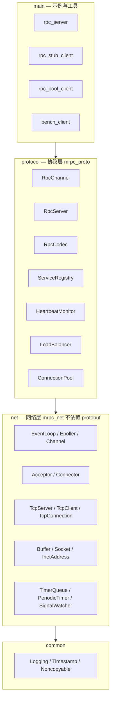
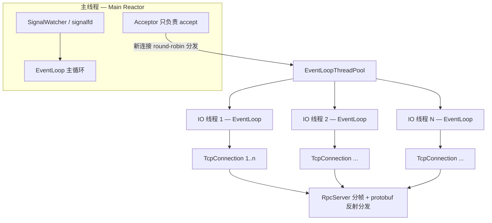
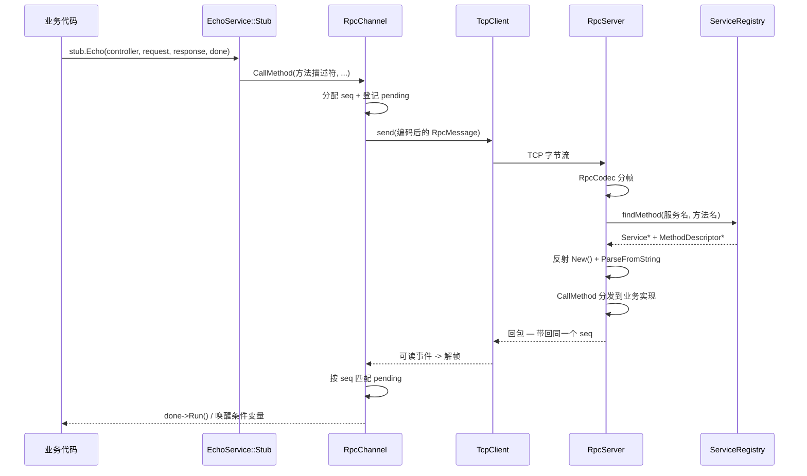
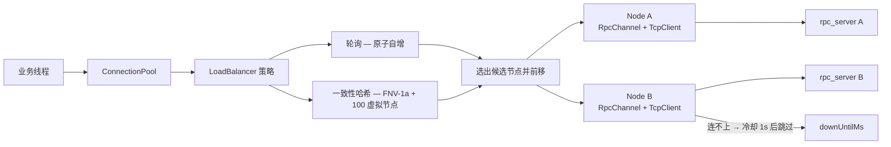

# mini-rpc

[English](README.en.md) | 中文

[](https://github.com/TiptopCash/mini-rpc/actions/workflows/ci.yml)
[](LICENSE)

> 基于 epoll 的 C++17 RPC 框架：主从 Reactor + 自定义二进制协议 + protobuf 反射分发 + 客户端连接池

从零实现一个可用的 RPC 框架，不依赖任何现成网络库（不含 muduo / gRPC）。
目标是把「一次 RPC 调用从生成代码到对端执行」的完整链路打通，
并在过程中用**实测数据**验证每一条关键路径（部分写、心跳超时、超时兜底、故障转移等），
而不是「写完就算通过」。

---

## 一、项目基本信息

| 项 | 内容 |
|---|---|
| 语言标准 | C++17 |
| 构建 | CMake 3.16+，默认 Release |
| 第三方依赖 | protobuf 3.21.12（序列化 + 反射分发）、pthread；**无网络库依赖** |
| 开发环境 | Windows 11 + WSL2 (Ubuntu)，g++ 15.2 / cmake 3.28.3 |
| 代码规模 | **65 个源文件，约 5850 行 C++**（不含 protobuf 生成代码与测试） |
| 网络模型 | epoll + **主从 Reactor**，one loop per thread，多 IO 线程 |
| 协议 | 8 字节固定头（magic / version / type / bodyLen）+ protobuf body |
| 质量手段 | ASan + UBSan + LeakSanitizer（带阳性对照），8 个端到端验证脚本 |

**关键设计取舍**

- **固定头只放分帧字段**，`seq` 等业务字段全部在 protobuf body 里——单一数据源，避免两处定义不一致。
- **网络层不依赖 protobuf**（`mrpc_net` 是独立静态库），所以心跳、超时这类需要编码 RPC 帧的逻辑放在 `mrpc_proto`。
- **所有持有 `Channel` 的对象必须在自己的 loop 线程析构**，为此给 `EventLoop` 加了 `runInLoopAndWait`。
- **一条连接靠 seq 多路复用支持并发在途请求**，所以连接池中一个节点只保留一条连接。

---

## 二、目录结构

```
.
├── CMakeLists.txt
├── proto/rpc.proto              # 协议消息 + EchoService 服务声明
├── scripts/                     # 8 个端到端验证脚本
└── src/
    ├── common/                  # 日志、时间戳、Noncopyable
    ├── net/                     # 网络层（不依赖 protobuf，可独立复用）
    │   ├── EventLoop / Epoller / Channel
    │   ├── Acceptor / Connector / TcpConnection
    │   ├── TcpServer / TcpClient / EventLoopThread(Pool)
    │   ├── Buffer / Socket / InetAddress
    │   └── PeriodicTimer / TimerQueue / SignalWatcher
    ├── protocol/                # 协议层（固定头分帧 + protobuf）
    │   ├── RpcHeader / RpcCodec / RpcError / RpcController
    │   ├── HeartbeatMonitor / ServiceRegistry
    │   ├── RpcServer / RpcChannel
    │   └── LoadBalancer / ConnectionPool
    ├── main/                    # 示例与工具程序（含自研压测客户端）
    └── test/                    # 单元测试（codec / timer_queue / tcp_client）
```

---

## 三、已实现模块

### 3.1 整体架构

**分层依赖**：`main` → `protocol` → `net` → `common`，单向不反向。
`net` 不依赖 protobuf（可独立复用），所以需要编码 RPC 帧的逻辑（心跳、请求超时）放在 `protocol`。



**主从 Reactor**：主线程只负责 `accept`，新连接 round-robin 交给 IO 线程；
每个 IO 线程一个 `EventLoop`（one loop per thread），线程间不共享连接状态。



**一次 RPC 调用的完整路径**（从生成代码到对端执行，再原路返回）：



**连接池与负载均衡**：池自持一个 `EventLoopThread`；每个节点一条连接
（协议按 seq 多路复用，单连接已支持大量在途请求）。



### 3.2 网络层 `mrpc_net`

| 模块 | 文件 | 实现要点 |
|---|---|---|
| 事件循环 | `EventLoop` | one loop per thread；`eventfd` 唤醒 `epoll_wait`；跨线程任务投递（`runInLoop` / `queueInLoop`）；`runInLoopAndWait` 提供「切到 loop 线程且阻塞等到做完」的析构原语 |
| 多路复用 | `Epoller` | epoll 封装，`data.ptr` 直接存 `Channel*` 做 O(1) 定位；返回事件数打满数组时自动扩容 |
| 事件通道 | `Channel` | 事件掩码 + 回调分发；`tie()` 用 `weak_ptr` 保证回调期间对象存活 |
| 监听 | `Acceptor` | 非阻塞 `accept4`，`SO_REUSEPORT` |
| 非阻塞连接 | `Connector` | `EINPROGRESS` → `EPOLLOUT` → `getsockopt(SO_ERROR)` 判定真实结果；指数退避重试（200ms 起，上限 5s）；fd 所有权经 `Socket::release()` 移交 |
| 连接管理 | `TcpConnection` | `shared_ptr` 生命周期；输出缓冲 + `EPOLLOUT` 处理部分写；半关闭处理 |
| 服务端 | `TcpServer` | 连接表管理；**延迟销毁**（`queueInLoop(connectDestroyed)`，避免在成员函数栈上析构自己） |
| 客户端 | `TcpClient` | 组合 Connector + TcpConnection；断线自动重连 |
| IO 线程池 | `EventLoopThreadPool` | 新连接 round-robin 分配到各 IO 线程 |
| 缓冲区 | `Buffer` | `readv` 分散读 + 栈上 64KB 临时缓冲；`readerIndex/writerIndex` 使 `retrieve` 为 O(1) |
| Socket | `Socket` | fd RAII；`TCP_NODELAY` / `SO_REUSEADDR` / `SO_REUSEPORT` |
| 周期定时器 | `PeriodicTimer` | timerfd 周期定时器，用于心跳扫描这类长生命周期任务 |
| 定时器集合 | `TimerQueue` | **一个 loop 一个 timerfd + 最小堆**，承载大量短生命周期定时器；懒删除 + `active_` 表 O(1) 取消；重复定时器按原到期时间递推**无漂移** |
| 信号 | `SignalWatcher` | signalfd 把 SIGINT/SIGTERM 变成普通 epoll 事件；`sigprocmask` 必须早于 IO 线程创建 |

### 3.3 协议层 `mrpc_proto`

| 模块 | 文件 | 实现要点 |
|---|---|---|
| 协议头 | `RpcHeader` | 8 字节固定头，大端读写，body 长度上限 64MB 防恶意包 |
| 编解码 | `RpcCodec` | 固定头分帧；返回 `kOk` / `kIncomplete`（残包留缓冲）/ `kError`（字节流失同步，关连接） |
| 消息定义 | `proto/rpc.proto` | `RpcMessage`（seq / service / method / payload / error）+ `EchoService`（`option cc_generic_services = true`） |
| 调用上下文 | `RpcController` | 实现 `google::protobuf::RpcController`；**每请求一个**，无需加锁 |
| 心跳 | `HeartbeatMonitor` | 周期扫描：空闲发 ping、超时强制断开；**只按接收时间判定**，避免自己发的 ping 重置计时器 |
| 服务注册表 | `ServiceRegistry` | 注册时预展开 `"服务名.方法名" → {Service*, MethodDescriptor*}`，运行期 O(1)；**非持有所有权**；能区分未知服务与未知方法 |
| RPC 服务端 | `RpcServer` | 组合 TcpServer + 心跳 + 分帧 + **protobuf 反射分发**；`MethodDone` 同时支持同步/异步实现；**请求级超时兜底**（业务漏调 `done->Run()` 时回超时并回收对象） |
| RPC 客户端 | `RpcChannel` | 实现 `google::protobuf::RpcChannel`；**seq 多路复用**；同步调用阻塞在条件变量、异步调用在 IO 线程执行 `done->Run()`；单次调用超时经 `TimerQueue`；迟到响应按 seq 查不到直接丢弃 |
| 负载均衡 | `LoadBalancer` | 轮询（原子自增）/ 一致性哈希（FNV-1a + 100 虚拟节点，节点列表变化才重建环） |
| 连接池 | `ConnectionPool` | 自持 `EventLoopThread`；一个节点一条连接；策略选中节点后顺序失败转移，连不上的节点进入**冷却** |

### 3.4 示例与工具

| 程序 | 用途 |
|---|---|
| `echo_server` / `echo_client` | 基础 echo 服务端 / 同步阻塞客户端 |
| `bench_client` | **自研多线程压测工具**，输出 QPS 与 P50/P90/P99/P999 |
| `slow_reader` | 慢读客户端，强制触发 `EPOLLOUT` 部分写路径 |
| `proto_echo_server` / `proto_echo_client` | 协议层端到端（粘包 / 半包）验证 |
| `idle_client` | 空闲连接测试（可切换回复 ack / 忽略 ping） |
| `rpc_server` | 反射分发示例服务端；`nodeTag` 参数用于在连接池演示中分辨节点 |
| `rpc_client` | 手写裸 socket RPC 客户端：正常调用 + 5 类错误码 + 多连接并发 |
| `rpc_stub_client` | 走完整客户端链路：同步 / 异步 / 业务失败 / 客户端超时 / 超时后连接仍可用 |
| `rpc_pool_client` | 连接池 + 负载均衡：轮询分散 / 一致哈希粘性 / 单节点故障转移 |

---

## 四、完成进度

| 阶段 | 内容 | 状态 |
|---|---|---|
| 第 1–2 周 | 网络层：epoll 主从 Reactor、IO 线程池、应用层缓冲 | ✅ 已完成 |
| 第 3–4 周 | 自定义 RPC 协议 + protobuf 序列化 + 心跳保活 | ✅ 已完成 |
| 第 5–6 周 | 服务端：protobuf 反射分发 + 服务注册表 | ✅ 已完成 |
| 第 7–8 周 | 客户端：`RpcChannel` + 连接池 + 负载均衡 | ✅ 已完成 |
| 第 9–10 周 | 服务发现（ZooKeeper）+ 压测 + 协程/内存池优化 | ⬜ 未开始 |

---

## 五、测试与验证记录

所有记录均为本机 WSL2 loopback 实测，验证脚本在 `scripts/` 下可复现。

### 5.1 内存安全（ASan + UBSan + LeakSanitizer）

- 构建：`-fsanitize=address,undefined -fno-omit-frame-pointer -g`（Debug）
- 覆盖：正常流量 5000 条 + 异常断开 30 次（`kill -9`）+ 64KB 大包 200 条
  + 客户端同步/异步/超时全路径 + 连接池轮询/一致性哈希/故障转移
- **结果：ASan / UBSan / LeakSanitizer 报告均为空**

> **为什么「报告为空」可信**：早期服务端被 `kill` 直接终止，析构根本不执行，
> LeakSanitizer 无从判定，只能设 `detect_leaks=0`——「无泄漏」这句话当时并未被验证。
> 补上 signalfd 优雅退出后改为 `detect_leaks=1`，并加了一个
> 「故意 `new int[100]` 不释放」的**阳性对照**确认检测器确实在工作。
> 有对照，空报告才有意义。

### 5.2 边界与并发

| 场景 | 结果 |
|---|---|
| 200 并发连接 × 200 条消息 | 失败 0 个，耗时 0.18s |
| 64KB × 2000 条 | QPS 20,875 / 21,661（两次运行），服务端存活 |
| 异常断开 × 30（`kill -9`） | 连接全部正确回收，无崩溃 |

### 5.3 EPOLLOUT 部分写路径

**为什么要专门验证**：socket 是非阻塞的，若部分写逻辑缺失，超出内核缓冲的数据会被静默丢弃。
正常情况下小包一次就写完，这条路径根本不会被触发。

**测试方法**：发送 64MB，随后 5 秒不读取，逼服务端进入
「`::write` 返回 `EAGAIN` → 数据进 `outputBuffer_` → `enableWriting` → `EPOLLOUT` 续传」。

**严谨性依据**：

```
tcp_rmem max = 32 MB   （客户端接收缓冲上限）
tcp_wmem max =  4 MB   （服务端发送缓冲上限）
内核最多可吞 36 MB  →  发送 64 MB > 36 MB
多余部分必然滞留在服务端应用层 outputBuffer_
```

**直接证据（服务端进程 RSS 采样）**：

```
基线 RSS      =  3,976 kB
stall 期间    = 67,160 kB
增量          = 63,184 kB   ← 即 outputBuffer_ 中滞留的数据
```

RSS 采样本身有几 MB 抖动（早前一次运行为 4,000 / 67,180 / 63,180 kB），
但增量稳定在 **63 MB 量级**，与「内核最多吞 36 MB」的推算吻合。

**结果**：64 MB 全部收回且逐字节校验一致，服务端无错误日志。

### 5.4 协议层（分帧 + protobuf）

**单元测试 `codec_test`：33 项检查，0 失败**

| 用例 | 覆盖内容 |
|---|---|
| 基本往返 | 编码 → 解析，字段逐项一致 |
| **半包（逐字节）** | 每喂 1 字节，收全前必须返回 `kIncomplete`，最后一字节才 `kOk` |
| **粘包（三帧）** | 单缓冲内连续解析 3 帧，顺序与内容正确 |
| 异常帧 ×5 | 魔数错、版本不兼容、body 超长、头部不完整、body 非法 protobuf |
| 空 body | 心跳帧合法解析 |
| 1MB 大 body | 跨缓冲扩容后内容一致 |

**端到端**：前半 500 条拼成单个字节流一次写入（制造粘包），后半 500 条每条拆两段、
间隔 0.5ms 写入（制造半包）。

```
发出: 1000 条（粘包 500 + 半包 500）
收回: 1000 条
序号连续性: 正确（异常 0）
内容一致性: 正确（异常 0）
```

### 5.5 心跳与空闲检测（`heartbeat_test`）

配置：扫描周期 1s，空闲 2s 发 ping，空闲 5s 强制断开。

**场景 1 — 客户端回复 ack（空闲但健康的连接应存活）**：空闲 8 秒**未被断开**，
每次 ack 都刷新了接收时间（服务端 ping 间隔因此为 3s 而非 2s）。

**场景 2 — 客户端忽略 ping（死连接应被回收）**：

```
17:54:22  ping #2 (idle 2s)
17:54:23  ping #2 (idle 3s)
17:54:24  ping #2 (idle 4s)
17:54:25  WARN  idle 5s >= timeout 5s, force close
```

**恰在 5s 被强制断开**。

### 5.6 服务端反射分发（`rpc_test`）

单连接 2000 条 + 5 类错误 + 4 并发连接 × 2000 条：

```
正常调用: 成功 2000/2000, 序号异常 0, 内容异常 0
错误码用例:
  未知服务       -> error_code=1  [OK]
  未知方法       -> error_code=2  [OK]
  坏 payload     -> error_code=3  [OK]
  业务失败       -> error_code=4  [OK]
  漏调 done->Run -> error_code=6  [OK]   （请求级超时兜底）
错误后连接仍可用: [OK]
并发 4 连接 x 2000 条: 失败 0
```

**反射分发的三段式**：

```
1. ServiceRegistry::findMethod("mrpc.EchoService", "Echo")  -> Service* + MethodDescriptor*
2. service->GetRequestPrototype(md).New()                   // 反射构造具体类型空对象
   request->ParseFromString(msg.payload())
3. service->CallMethod(md, controller, request, response, done)
```

框架全程只持有 `Message*` 基类指针，不感知具体类型——**新增一个 RPC 方法只改 `.proto`，
`RpcServer` / `ServiceRegistry` / `RpcCodec` 一行都不用动**。

### 5.7 优雅退出与泄漏检测（`verify.sh` / `rpc_test.sh`）

用 **signalfd** 把信号接入 epoll——与已有的 `eventfd`（唤醒）、`timerfd`（定时器）
是同一套思路，信号不再是异步的「信号处理函数」而是普通的 fd 可读事件：

```
SIGINT/SIGTERM --(sigprocmask 屏蔽)--> 挂起在进程上
              --(signalfd)--> 可读事件 --> 主 loop 的 Channel 回调
              --> loop.quit() --> loop() 正常返回 --> 对象按序析构
```

**关键坑**：`sigprocmask` 必须在**创建 IO 线程之前**执行。新线程继承创建时刻的信号掩码，
若先起了 IO 线程再屏蔽，那些线程仍按默认动作处理 SIGTERM，进程照样被直接杀掉。

```
SigBlk: 0000000000004002      # bit1=SIGINT(2), bit14=SIGTERM(15)
tasks = 5                     # 主线程 + 4 IO 线程全部继承
```

结果：SIGTERM 后 `loop()` 正常返回、对象按序析构、进程 `exit=0`。

### 5.8 通用定时器与请求级超时兜底

`PeriodicTimer` 只能表达「固定周期的长期任务」，无法承载「每次请求一个」的超时定时器
（那会为每个请求起一个 timerfd，fd 被打爆）。`TimerQueue` 用
**一个 loop 一个 timerfd + 最小堆**管理任意多个定时器。

**单元测试 `timer_queue_test`：6 个用例全部通过**

```
[1] 一次性定时器按到期时间触发（乱序加入 30/10/20 -> 按 10/20/30 触发）
[2] 取消未到期的定时器
[3] 取消未知 id 与重复取消（不崩溃、不影响无关定时器）
[4] 重复定时器 + 回调内自取消
[5] 重复定时器不累积漂移  -> 实测总耗时 215 ms（期望约 215 ms）
[6] 跨线程 addTimer / cancelTimer（延迟准确，投递排队时间未计入）
```

**用例 5 是这套实现的核心价值**：回调本身耗时 15ms、间隔 20ms。
若按「回调结束后再等一个间隔」的朴素写法，10 次约需 `10 × (20+15) = 350 ms`
且误差随次数线性累积；按**原到期时间递推**则稳定在 200ms 量级，实测 215 ms。

**请求级超时兜底**：业务实现漏调 `done->Run()` 时，框架在 `requestTimeoutMs_`
后回 `kRpcTimeout` 并回收 request / response / controller / `MethodDone`。
关键在于**仲裁标志放在独立的共享对象里**：

```cpp
struct RequestGate { std::atomic<bool> finished{false}; ... };
if (gate->finished.exchange(true)) return;   // CAS 决定谁收尾，输的一方直接返回
```

不能把这个标志放在 `MethodDone` 里——CAS 的赢家会 `delete` 掉 `MethodDone`，
输的那一方再去读它的成员就是 use-after-free。

**实测**：

```
服务端日志: timed out in mrpc.EchoService.NoReply
客户端日志: no pending call for seq ...      <- 超时后服务端的迟到响应被丢弃
LeakSanitizer 报告为空                       <- 此前必漏的对象已被回收
```

「迟到响应被丢弃」是**故意构造**的：客户端超时设 150ms、服务端兜底设 400ms，
于是兜底响应必然在客户端摘除登记之后才到达。

### 5.9 客户端完整链路（`stub_client_test`）

链路：`EchoService::Stub`（protoc 生成的动态代理）→ `RpcChannel` →
`TcpClient` → `Connector` → 非阻塞 connect。

```
同步调用: 成功 200/200 [OK]
同步业务失败: [OK] (text must not be empty)
异步调用: 成功 200/200 [OK]
异步业务失败: [OK] (text must not be empty)
超时调用: [OK] (rpc call timed out after 150 ms)
超时后连接仍可用: [OK]
```

`tcp_client_test` 另外覆盖：非阻塞 connect + 收发 / 对端未就绪时退避重试后自动连上 /
对端断开后自动重连（3 个用例全部通过）。

### 5.10 连接池与负载均衡（`pool_client_test`）

两个后端节点（`nodeTag` 分别为 A / B），客户端 100 次调用：

```
---- 轮询 ----
轮询: 成功 100/100  [A]=50  [B]=50
---- 一致性哈希（固定 key）----
一致性哈希: 成功 100/100  [B]=100
一致性哈希(另一 key): 成功 100/100  [B]=100
---- 失败转移（关掉节点 B 之后）----
失败转移: 成功 100/100  [A]=100
```

**关于「失败节点冷却」的对照实验**：第一版没有冷却，一个挂掉的节点会让**每次**
`getChannel()` 都白等满连接超时（3 秒）。对着「一个节点可用、10 次调用」做对照：

| 冷却 | 耗时 | 结果 |
|---|---:|---|
| 无（冷却时间置 0） | **15.0 s** | 10/10 成功 |
| 1 s | **3.0 s** | 10/10 成功 |

无冷却时轮询让一半调用（5 次）各付 3 秒连接超时，即 `5 × 3s = 15s`。
本质区别是「**每个冷却周期最多付一次连接超时**」而不是「每次调用付一次」，
所以调用越密、差距越大。

### 5.11 验证脚本一览

| 脚本 | 内容 |
|---|---|
| `scripts/verify.sh` | ASan/UBSan 构建与运行 + 边界测试 |
| `scripts/bench.sh` | 多配置压测 |
| `scripts/slow_reader_test.sh` | `EPOLLOUT` 部分写强制测试（含 RSS 采样） |
| `scripts/proto_test.sh` | 协议层单元测试 + 端到端（粘包/半包） |
| `scripts/heartbeat_test.sh` | 心跳保活 + 空闲超时断开 |
| `scripts/rpc_test.sh` | 反射分发 + 错误码 + 并发 + 优雅退出；含 LeakSanitizer（带阳性对照） |
| `scripts/stub_client_test.sh` | 客户端链路 + 超时兜底 + 迟到响应丢弃 |
| `scripts/pool_client_test.sh` | 轮询分散 + 一致哈希粘性 + 故障转移 |

---

## 六、性能数据

### 测试条件

- 服务端：4 个 IO 线程（`echo_server 9100 4`）
- 客户端：`bench_client`，多线程同步请求-响应，每线程一条连接
- 环境：WSL2 loopback，**客户端与服务端同机**
- 消息：echo 回环

### 结果

| 客户端线程 | 消息大小 | QPS | P50 | P90 | P99 | P999 | 失败 |
|---:|---:|---:|---:|---:|---:|---:|---:|
| 4 | 64 B | 101,398 | 37.2 µs | 43.4 µs | 100.0 µs | 191.2 µs | 0 |
| **8** | **64 B** | **195,350** | **30.2 µs** | 69.7 µs | **115.0 µs** | 171.8 µs | 0 |
| 16 | 64 B | **269,405** | 54.9 µs | 84.6 µs | 178.6 µs | 274.8 µs | 0 |
| 8 | 1 KB | 186,399 | 32.1 µs | 72.8 µs | 119.4 µs | 175.4 µs | 0 |
| 8 | 16 KB | 162,356 | 39.1 µs | 81.3 µs | 134.0 µs | 204.7 µs | 0 |
| 4 | 64 KB | 67,247 | 56.5 µs | 64.5 µs | 144.7 µs | 262.6 µs | 0 |

### 数据解读

- **8 线程是拐点**：并发翻倍到 16 线程，QPS 仅 +38%（19.5 万 → 26.9 万），
  P50 从 30 µs 涨到 55 µs，呈现典型**收益递减 + 排队延迟**。
- **数字是下限，不是上限**：客户端与服务端同机竞争 CPU，实测值 =
  「客户端 + 服务端」合计消耗。服务端独立部署时吞吐更高。
- **64 KB 时 P50≈P90≈60 µs**：延迟由带宽而非 CPU 主导，曲线形态变化符合预期。
- **跨次运行波动很大，引用时要给区间**：同一份代码、同一配置，
  「8 线程 / 64B」在不同时间点重测得到 **19.5 万**（本文数据）与 **24.8 万**（早前记录），
  差约 26%；「16 线程 / 64B」为 **26.9 万** 与 **31.2 万**。
  同机 loopback 压测里客户端和服务端共享 CPU、互相争抢，
  这个量级的抖动是正常的，所以只能按「量级」引用，不能把单次峰值当承诺值。

> ⚠️ 引用数据务必注明测试方式（Loopback / 同机 / IO 线程数 / 消息大小）**和取值范围**，
> 否则没有可比性。

---

## 七、快速开始

**依赖**：CMake ≥ 3.16、支持 C++17 的编译器、protobuf（`protoc` + `libprotobuf-dev`）、pthread。

```bash
# 构建
cmake -B build -DCMAKE_BUILD_TYPE=Release
cmake --build build -j

# 启动服务端：端口 9300，4 个 IO 线程，心跳 10s，空闲 30s 断开，请求兜底 5000ms
./build/src/rpc_server 9300 4 10 30 5000

# 另开一个终端：Stub 客户端跑 200 次同步 + 异步 + 超时用例
./build/src/rpc_stub_client 127.0.0.1 9300 200

# 单元测试
cd build && ctest --output-on-failure

# 端到端验证（含 ASan/UBSan/LeakSanitizer）
bash scripts/rpc_test.sh
bash scripts/stub_client_test.sh
bash scripts/pool_client_test.sh
```

**连接池演示**：启动两个带 tag 的后端，再跑 `rpc_pool_client`

```bash
./build/src/rpc_server 9360 2 0 0 0 A &
./build/src/rpc_server 9361 2 0 0 0 B &
./build/src/rpc_pool_client 127.0.0.1 9360 9361 100 all
```

---

## 八、后续计划

- **服务发现**：节点列表目前是静态配置，下一步接 ZooKeeper 做注册与订阅，让扩容缩容不必改配置重启
- **熔断**：当前只有「连不上进冷却 1 秒」的朴素失败转移，没有失败率统计与熔断器
- **TSan**：内存安全已用 ASan/UBSan 验证，线程安全还没有跑过 ThreadSanitizer
- **减少拷贝**：回包路径目前是 `Buffer → std::string → conn->send()`，可加 `send(Buffer*)` 重载
- **协程化**：用 C++20 协程改写异步调用路径并做性能对比
- **收敛定时器**：`PeriodicTimer` 与 `TimerQueue` 两套机制语义上有重叠，可合并（当前刻意保留并各自注明分工）
